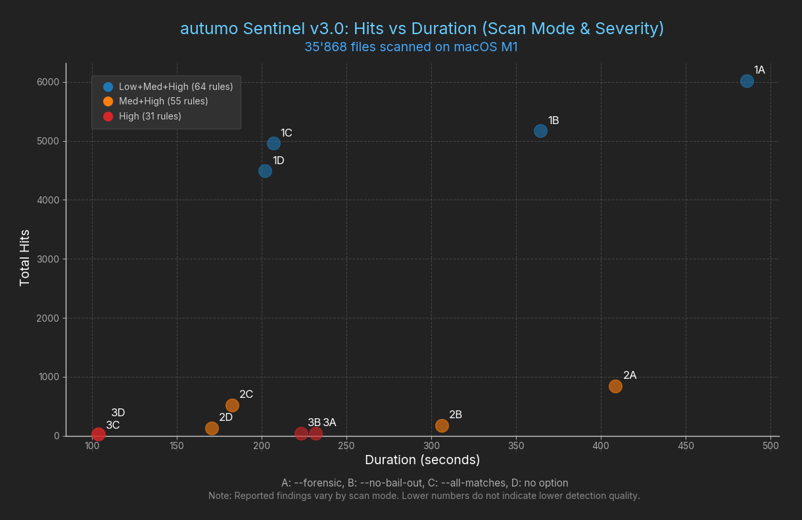

# autumo Sentinel


**Multi‑Stage Supply‑Chain Malware Scanner & Code Forensics Engine**

autumo Sentinel is a heuristic-driven, multi-stage scanner for detecting supply-chain malware, loaders, obfuscation, and persistence in source code, scripts, and build artifacts. Unlike signature-based scanners, it emphasizes contextual rule combinations to model realistic attack flows.

## Features

- 🧠 **Multi-Stage Heuristics Engine**
   Detects malicious flows across multiple stages: Decode → Exec → Persistence
- 🔍 **Code Forensics, not Simple Pattern Matching**
   Focuses on context, sequence, and combination of actions
- 🧩 **Rule-Based Architecture**
   Rules are transparent, version-controlled, and easily extendable
- 🛡️ **False-Positive Minimization**
   Uses keyword combinations, sequences, and thresholds instead of single token matches
- 🧪 **Language-Agnostic**
  Supports:
  - Unix Shell
  - PowerShell
  - JavaScript / TypeScript
  - Python
  - C/C++
  - Ruby
  - ...and more
- ⚡ **No External Dependencies**
  Uses **only Python core libraries**; no virtual environment or package installation is required.
  Python 3.10+ recommended. Tested on Windows, macOS, and Linux.

## Performance Overview

The following chart provides an overview of **autumo Sentinel v3.0** across 12 runs with different combinations of severity levels and scan options. It visualizes the relationship between **total hits** and **scan duration**, highlighting the impact of severity and forensic-related options.



Each point represents a single run:
- **Labels**:
  - A: `--forensic`  
  - B: `--no-bail-out`  
  - C: `--all-matches`  
  - D: no additional option  
- **Colors** indicate severity coverage:
  - Blue: Low + Medium + High  
  - Orange: Medium + High  
  - Red: High only

## Multi-Stage Detection (Core Concept)

autumo Sentinel follows a strict, staged scanning model, where each stage has a clearly defined scope. This ensures predictable results and helps reduce false positives.
Detection is progressive, with each stage building on the previous one:

| Stage | Scope                | Purpose                                                                 |
|-------|--------------------|-------------------------------------------------------------------------|
| 1     | Filenames           | Hygiene check: identify unusual or suspicious filenames in the project directory. |
| 2     | Project + caches    | Pattern scanning: detect suspicious content using plain and regex patterns; surfaces raw indicators. |
| 3     | Line + file         | Heuristic rules: combine evidence from filenames, patterns, and previous heuristic hits; thresholds refine triggers. |

> This staged architecture ensures a clear separation of scopes and rule types while enabling robust, multi-stage malware detection.

### Stage 1: Filename Analysis (Project Directory Only)

- Evaluates file and directory names only within the project directory
- Detects suspicious naming patterns (temporary, hidden, unusual)
- Does not scan caches or apply heuristics
- Serves primarily as a hygiene and awareness check for developers

### Stage 2: Pattern Scanning (Project + Cache Directories)

- Scans file contents in the project directory and optionally local/global caches
- Supports two pattern types:
  - Plain patterns – direct string matches
  - Regex patterns – dynamic, obfuscated, or encoded content
- Stage 2 surfaces raw indicators, without rule correlation

### Stage 3: Heuristic Rules

- Applied only if heuristic scanning is enabled
- Configurable thresholds and conditional execution
- Categorized by scope and type:

| Scope | Types | Description |
|-------|-------|-------------|
| line-scoped | `keyword_combination`, `base64_suspect`, `hex_suspect`, `string_length`, `path_access` | Evaluates individual lines for suspicious keyword combinations, payloads, or sequences. Thresholds and `only_if_no_match` conditions refine triggers. |
| file-scoped | `keyword_combination`, `obfuscation_vars`, `obfuscation_strings` | Evaluates entire files for structural obfuscation, string concatenation, suspicious variable patterns, and combinations. |


> **Heuristic threshold**: Rules are applied in order, and the heuristic threshold determines how many indicators must match before the rule triggers. Thresholds apply only to line-scoped rules.

> **Rule definitions and examples:**  
> The public repository includes a limited set of low‑severity heuristic rules for demonstration purposes.  
> For details on rule structure, evaluation order, and the public rule policy, see  
> **[Rule Set Policy](rules/rule-set-policy.md)**.

#### Rule Evaluation Order

Rules are evaluated in a deterministic and transparent order to ensure predictable, explainable, and efficient detection results. The sorting groups are:

1. **Severity**
   - Rules are evaluated strictly by severity level: high → medium → low.
   - Severity is dominant and cannot be overridden by priority, scope, or overlap.

2. **Priority** (Optional)
   - Within the same severity, rules may define an optional `priority` field.
   - Higher values indicate higher priority.
   - If omitted, a default priority of `100` is assumed.

3. **Scope**
   - Within the same severity and priority group, rules with `scope = "line"` are evaluated before `scope = "file"`.
   - This ensures line-level detections trigger before broader file-level heuristics.

4. **Overlap** (`only_if_no_match`)
   - Within the same scope group, rules allowing overlap (`only_if_no_match = false`) are evaluated first.
   - Rules with `only_if_no_match = true` act as fallback rules and are only evaluated if no previous rule matched in the same scope.

5. **JSON order as final tie-breaker**
   - If all criteria above are equal, rules are evaluated in the order they appear in the JSON configuration.

> Within each sorting group — that is, rules sharing the same Severity, optional Priority, Scope, and Overlap — the JSON order determines evaluation. Manually ordering rules in the JSON affects only this group and does not override the precedence of Severity, Priority, Scope, or Overlap.

## Writing Your Own Rules

autumo Sentinel allows you to create custom rules tailored to your projects. You can define:

- **New heuristics** – detect patterns or behaviors not covered by built-in rules.
- **Custom combinations** – combine multiple indicators to trigger a rule only under specific conditions.
- **Custom thresholds** – adjust the sensitivity of heuristic scoring to reduce false positives or catch subtle patterns.
- **Project-specific policies** – enforce rules that apply only to your codebase or environment.

Example Rule:

```json
{
  "id": "custom_example_rule",
  "name": "Custom keyword combination",
  "description": "Detects a project-specific combination of keywords.",
  "type": "keyword_combination",
  "severity": "medium",
  "priority": 100,
  "scope": "line",
  "only_if_no_match": true,
  "heuristic_threshold": 2,
  "applies_to": { "extensions": ["python", "javascript"] },
  "parameters": {
    "keywords": ["customFunc", "dangerousCall"]
  }
}
```

> Note: `applies_to.extensions` can be omitted. If not specified, the rule will apply by default only to the file types listed under `artifacts.extensions` and `artifacts.content_files` in `config/config.json`.

## CLI Usage

```sh
sentinel <directory> [options]
```
> By default, Sentinel uses `config/config.json` for logging, outputs, patterns, and rules.

### Options

- `-l, --local`
  Include local caches in the scan (OS-specific).
  Examples:
  - Linux/macOS: `~/.cache/node`, `~/.npm`
  - Windows: `%APPDATA%\npm-cache`, `%LOCALAPPDATA%\npm-cache`

- `-g, --global`
  Include global caches in the scan (OS-specific).
  Examples:
  - Linux/macOS: `/tmp`
  - Windows: `%LOCALAPPDATA%\Temp`

- `-k, --heuristics`
  Enable heuristic scanning. Runs additional line- and file-based heuristic rules beyond static signature matching.

- `--heuristics-level <low|medium|high>`
  Limit heuristic rules to a minimum severity level:
  - low – all heuristic rules (default)
  - medium – medium and high severity only
  - high – high severity only

- `--no-bail-out`
  Disable bail-out limits. Processes entire files without line or character limits. May significantly increase scan time.

- `--all-matches`
  Evaluate all heuristic rules, ignoring rules marked with `only_if_no_match`.

- `--forensic`
  Enable forensic mode (equivalent to `--no-bail-out` + `--all-matches`).

- `--exclude-dirs <dir1,dir2,...>`
  Comma-separated list of directory names to exclude from scanning (matched by directory basename).
  Example: `--exclude-dirs node_modules,.git,dist`

- `-c, --config <file>`
  Path to the JSON configuration file. Default: `config/config.json`

- `-h, --help`
  Show help message and exit.

### Description

Performs a multi-stage malware scan focused on supply-chain threats and suspicious developer artifacts.

### Scanning Includes

- Detection of suspicious filenames
- Script-level indicators in shell scripts
- Content pattern analysis in source files
- Optional heuristic analysis (line- and file-based)
- Optional scanning of local and global cache directories

### Configuration Files

- `config/config.json`
- `patterns/files.txt`
- `patterns/shell.txt`
- `patterns/shell_rx.txt`
- `patterns/content.txt`
- `patterns/content_rx.txt`
- `rules/rules*.json`

### Examples

```sh
sentinel myproject
sentinel myproject -k
sentinel myproject -k --heuristics-level medium
sentinel myproject --forensic
sentinel myproject -l --exclude-dirs node_modules,venv,dist,.git
```

## Logging / Output

autumo Sentinel writes scan results and debug information according to the configuration in `config/config.json`.  

### Default Output Files

| Field | Description | Default |
|-------|------------|---------|
| `csv_file` | Detailed scan hits per file, filename, pattern and rule | `log/scan-hits.csv` |
| `csv_pivot_file` | Pivoted summary of scan hits per pattern/rule for analysis | `log/scan-hits-pivot.csv` |
| `log_file` | General scan log, warnings, and debug info | `log/scan.log` |
| `debug_mode` | Enables verbose logging for troubleshooting | `true` |

### Notes

- All paths are relative to the execution directory unless an absolute path is provided.  
- The CSV reports contain structured information about each detection: file, line (if applicable), rule, severity, and matched indicators.  
- The log file includes runtime messages, errors, and optionally debug information depending on `debug_mode`.

## Editions & Licensing

autumo Sentinel is **dual-licensed**, with separate Open Source and Commercial editions.

### Open Source Edition (GitHub)

## Editions & Licensing

autumo Sentinel is **dual-licensed**, with separate Open Source and Commercial editions.

| Edition                | License                              | Includes                                                                                       | Not included / Notes                                                                                  |
|------------------------|-------------------------------------|------------------------------------------------------------------------------------------------|------------------------------------------------------------------------------------------------------|
| Open Source Edition    | GPLv3                                | Core engine, Rule framework, Low-Severity Rules (example rules), Documentation for custom rules | Medium & High-Severity Rules, Production-ready rulesets, Advanced correlation packs                 |
| Commercial Edition     | autumo Products General License v1.1 | Medium & High Severity Rules, Advanced heuristic combinations, Loader/Privilege/Persistence/Network+Exec rules, Advanced correlation packs, Rule updates, Optional support & integration | Suitable for CI/CD, enterprise, or security teams; Contact: [https://www.autumo.ch](https://www.autumo.ch) / info@autumo.com |

### When a Commercial License is Required

A commercial license is required if you:

- Use Medium or High severity rules
- Integrate Sentinel into proprietary software
- Provide Sentinel as a service
